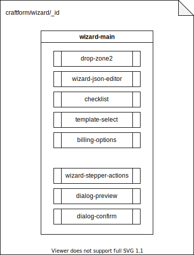
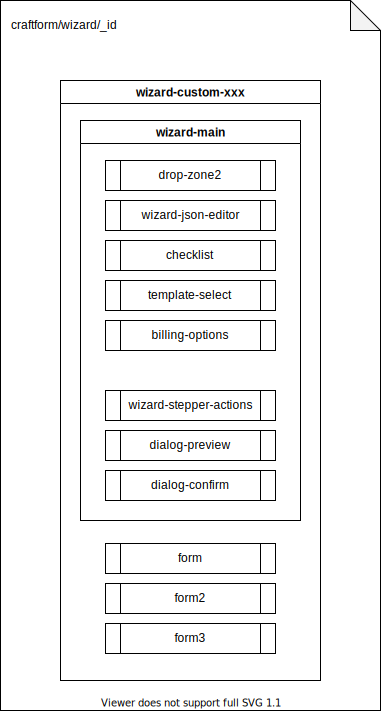

# Service front

The service front is build with :

* [nuxtjs 3](https://nuxtjs.org/) (see [nuxt tricks](nuxt.md))
* [vuejs 3](https://vuejs.org/)
* [tailwindcss](https://tailwindcss.com/)
* [daisyui](https://daisyui.com/)

## craftform components

Here is the components encapsulation for the generic craftform wizard page :

Here is the components encapsulation for a custom craftform wizard page :

