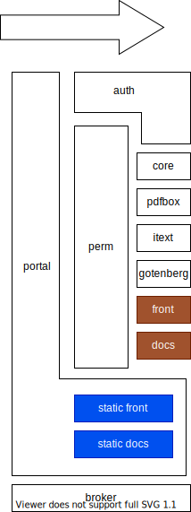

# portal service

`portal` service responds to all HTTP incoming requests.




brown/blue locations are for dev/prod instances.

## auth service

auth service have part of its endpoints publicly reachable via `portal`
and another part filtered via `perm` service.

Here are the publicly reachable endpoints :

* `/api/auth/*`

Here are some example of filtered endpoints :

* `/api/checkout/*`


## URLs

!!! danger "outdated"
    Probably oudated, should be updated

Static URLS :

|   URL    |  image path  | service  |
| -------- | ------------ | -------- |
| /        | /app/site    | site     |
| /docs    | /app/docs    | docs     |
| /front   | /app/front   | front    |
| /mycheck | /app/mycheck | dropzone |
| /public  | /app/public  | portal   |


## local dev

To launch caddy locally :
```
make dev-portal
```

You can set environment variables to define the behaviours of the services
(static or proxy, proxy hostname).


## misc

[ingress/proxy alternatives](https://medium.com/flant-com/comparing-ingress-controllers-for-kubernetes-9b397483b46b)


