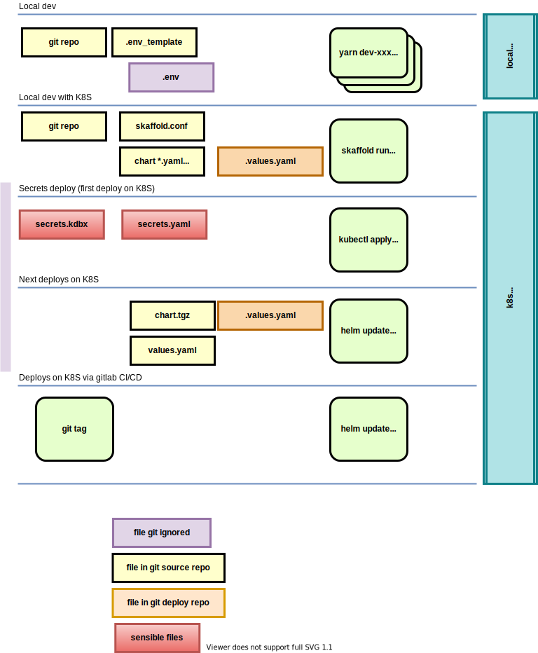

# Deployment



OBSOLETE : see deploy/paxpar/secrets_and_configmap.md

Sample .env_template (in source git repo) :
```

# S3 storage for session objects
S3_SESSION_HOST=paris.scaleway.com
S3_SESSION_ACCESS_KEY=6787897HJHK66
S3_SESSION_SECRET_KEY=xxxxxxxxxxxxxxxxx
S3_SESSION_BUCKET_NAME=session-store-prod

# SQL storage
DB_URL=postgrel://pg.ovh.fr
DB_USER=bob
DB_PASSWORD=xxxxxxxxxxxxxxxxx

# SMTP conf for sending email
SMTP_SERVER=smtp.gandi.net
SMTP_TLS=1
SMTP_SSL=0
SMTP_PORT=443
SMTP_USER=YRUYU-666-655
SMTP_PASSWORD=xxxxxxxxxxxxxxxxx
```

Sample `.env` file from `.env_template` (never store in source git repo !!) :
```
# S3 storage for reference objects (checklist, craft, ...)
S3_REF_HOST=paris.scaleway.com
S3_REF_ACCESS_KEY=6787897HJHK66
S3_REF_SECRET_KEY=YUYU5656567
S3_REF_BUCKET_NAME=session-store-prod

# S3 storage for session objects
S3_SESSION_HOST=paris.scaleway.com
S3_SESSION_ACCESS_KEY=6787897HJHK66
S3_SESSION_SECRET_KEY=YUYU5656567
S3_SESSION_BUCKET_NAME=session-store-prod

# SQL storage
DB_URL=postgrel://pg.ovh.fr
DB_USER=scott
DB_PASSWORD=tiger6655

# SMTP conf for sending email
SMTP_SERVER=smtp.gandi.net
SMTP_TLS=1
SMTP_SSL=0
SMTP_PORT=443
SMTP_USER=YRUYU-666-655
SMTP_PASSWORD=76è_tyu67678T
```

values.yaml (in source git repo)

```yaml
storage:
    reference:
        # S3 storage for reference objects (checklist, craft, ...)
        host: paris.scaleway.com
        access_key: 6787897HJHK66
        # Overide it :
        #secret_key: xxxxxxxxxxxxxxxxx
        bucket: session-store-prod
    session:
        # S3 storage for session objects
        host: paris.scaleway.com
        access_key: 6787897HJHK66
        # Overide it :
        #secret_key: xxxxxxxxxxxxxxxxx
        bucket: session-store-prod

# SQL storage
DB_URL: postgrel://pg.ovh.fr
DB_USER: scott
# Overide it :
#DB_PASSWORD: xxxxxxxxxxxxxxxxx

# SMTP conf for sending email
smtp:
    image: redhat/mailer:4.3
    server: smtp.gandi.net
    tls: 1
    ssl: 0
    port: 443
    user: YRUYU-666-655
# Overide it :
#SMTP_PASSWORD: xxxxxxxxxxxxxxxxx
```

Service **postman** needs to access SQL storage and SMTP server.
Its helm configuration is:
```yaml
apiVersion: apps/v1
kind: Deployment
spec:
  replicas: 1
  template:
    metadata:
      labels:
        app.kubernetes.io/name: postman
        app.kubernetes.io/instance: {{ .Release.Name }}
    spec:
      containers:
        - name: {{ .Chart.Name }}
          image: "{{ .Values.smtp.image }}"

          env:
            - name: CONVERT_PDF_API
              value: http://paxpar-conv:3010
            - name: SIGN_API
              value: http://paxpar-portal
            - name: PYTHONUNBUFFERED
              value: "TRUE"
            - name: SMTP_SERVER
              value: {{ .Values.smtp.server | quote }}
            {{- if .Values.smtp.tls }}
            - name: SMTP_TLS
              value: "--tls-active 1"
            {{- end }}
            - name: SMTP_SSL
              value: {{ .Values.smtp.ssl | quote }}
            - name: SMTP_PORT
              value: {{ .Values.smtp.port | quote }}
            - name: SMTP_USER
              value: {{ .Values.smtp.user | quote }}
          ports:
            - name: http
              containerPort: 8881
              protocol: TCP
```

Service **forminput** needs to access SQL storage and S3 ref storage.
Its helm configuration :
```yaml
apiVersion: apps/v1
kind: Deployment
spec:
  replicas: 1
  template:
    metadata:
      labels:
        app.kubernetes.io/name: forminput
        app.kubernetes.io/instance: {{ .Release.Name }}
    spec:
      containers:
        - name: {{ .Chart.Name }}
          image: "{{ .Values.smtp.image }}"

          env:
            - name: S3_REF_HOST
              value: {{ .Values.storage.reference.host }}
            - name: S3_REF_ACCESS_KEY
              value: {{ .Values.storage.reference.access_key }}
            - name: S3_REF_BUCKET_NAME
              value: {{ .Values.storage.reference.bucket }}

          ports:
            - name: http
              containerPort: 8881
              protocol: TCP

```

Sample keepass file content `myapp_prod.kbdx` :

* S3_REF_SECRET_KEY
* S3_SESSION_SECRET_KEY
* DB_PASSWORD
* SMTP_PASSWORD
* GITLAB_SECRET

The keepass wallet is converted to a `secret.yaml`with the command
`keepass2secrets myapp_prod.kbdx`.

!!! warning

    The `secret.yaml` is very sensible.

    Never keep it or store ir.

We have our chart `my_appv3.2.5.tgz`.

We have the customized conf for our server PLUTON :  `values_pluton.yaml`

We have the secret conf :  `secret.yaml`


```shell
# first install
kubectl apply  -f secret.yaml -n myapp_namespace
# or
kubectl apply  -n myapp_namespace < keepass2secrets myapp_prod.kbdx
```

```shell
# upgrade to a new version
helm upgrade \
    -f values_pluton.yaml \
    -n myapp_namespace \
    my_appv3.2.5.tgz
```

# Génération des secrets

## Gitlab registry


Test de connexion au registry gitlab :
```shell
docker login registry.gitlab.com
```

!!! Note
    The `registry-credentials` is created by the gitops CI/CD.

Génération du secret après login :
```shell
kubectl create secret generic registry-credentials \
    -n paxpar \
    --from-file=.dockerconfigjson=/root/.docker/config.json \
    --type=kubernetes.io/dockerconfigjson
```

Génération du secret en ligne :
```shell
kubectl create secret docker-registry registry-credentials \
    -n <your-namespace> \
    --docker-server=<your-registry-server> \
    --docker-username=<your-name> \
    --docker-password=<your-pword> \
    --docker-email=<your-email>
```


cf [Récupération d'une image d'un registre privé](https://kubernetes.io/fr/docs/tasks/configure-pod-container/pull-image-private-registry/)

## Variable environnement

[Distribute Credentials Securely Using Secrets](https://kubernetes.io/docs/tasks/inject-data-application/distribute-credentials-secure/)


```yaml
apiVersion: v1
kind: Pod
metadata:
  name: env-single-secret
spec:
  containers:
  - name: envars-test-container
    image: nginx
    env:
    - name: SECRET_ERIC
      valueFrom:
        secretKeyRef:
          name: backend-user
          key: backend-username
```

Secret généré par :
```shell
kubectl create secret generic backend-user \
    -n paxpar \
    --from-literal=backend-username='backend-admin'
```

Valeurs plus réalistes :

```yaml
apiVersion: v1
kind: Pod
metadata:
  name: env-single-secret
spec:
  containers:
  - name: envars-test-container
    image: nginx
    env:
    - name: S3_SECRET
      valueFrom:
        secretKeyRef:
          name: paxpar-prod-secrets
          key: s3.secret
    - name: STRIPE_SECRET
      valueFrom:
        secretKeyRef:
          name: paxpar-prod-secrets
          key: stripe.secret
```

Secret généré par :
```shell
kubectl create secret generic paxpar-prod-secrets \
    -n paxpar \
    --from-literal='postgresql.password=iuYUoiyUIyuiYUYIUI' \
    --from-literal='gitlab.secret=6756756756567567567' \
    --from-literal='s3.secret=6786è_-78-78678678' \
    --from-literal='stripe.secret=899_789789789767675-('
```

## Handling secrets

Secrets can be generated from `.env` file :
```
kubectl create secret generic paxpar-prod-secrets \
    --from-env-file=.env
```
