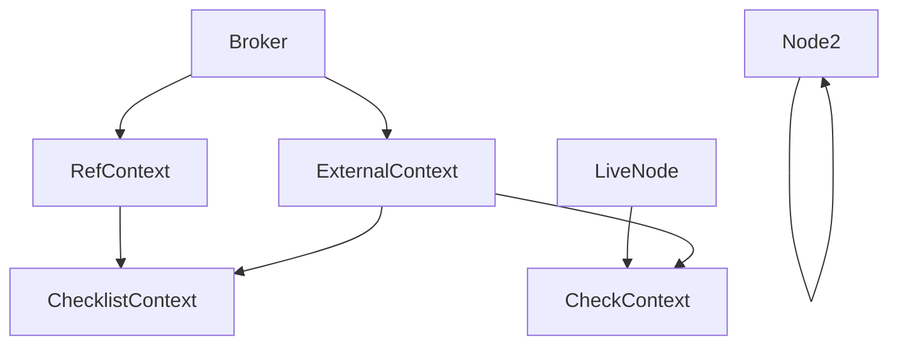

# check deps

result :

```mermaid
graph TD
    Broker --> ExternalContext

    RefContext --> ChecklistContext
    ExternalContext --> ChecklistContext

    Node2 --> Node2

    Broker --> RefContext

    LiveNode --> CheckContext
    ExternalContext --> CheckContext
```
