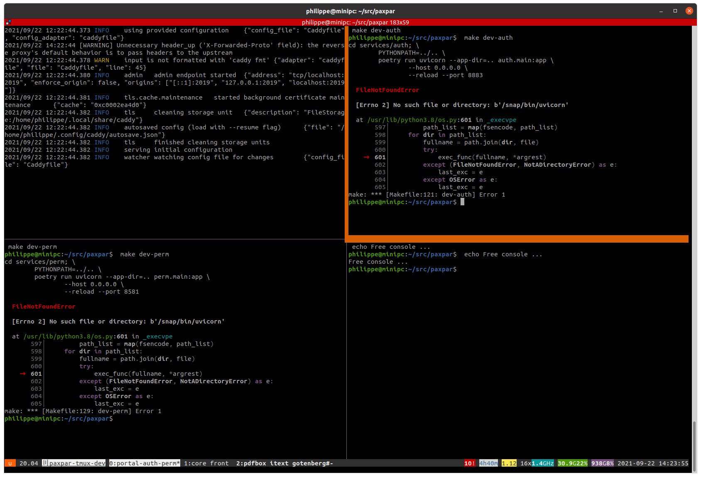

# Local development

## setup


```shell
# go to your paxpar source folder
cd ~/src/paxpar
# setup the environment (once)
make setup
```

## byobu/tmuxp session



We've got a [tmuxp](https://github.com/tmux-python/tmuxp) configuration file : `.tmuxp.yaml` which automates
the creation off all tmux panes/windows.

To run tmuxp inside byobu do :
```shell
# inside the paxpar source folder
# start a byobu session
$ byobu
# then launch the windows/panes defined with tmuxp  :
$ tmuxp load .
```


You can easily detach and later re-attach to the existing session with :

```shell
# you don't need to launch byobu again
# restore byobu with tmux :
$ tmux a
# or launch again byobu to re-attach
$ byobu
# or just load the tmuxp again :
$ tmuxp load .
paxpar-tmux-dev is already running. Attach? [Y/n]:
```

You can customize your session windows/panes in the `.tmuxp.yaml`.
Here is an example :

```yaml
session_name: paxpar-tmux-dev
windows:
  - window_name: portal-auth-perm
    layout: tiled
    panes:
      - make dev-portal
      - make dev-auth
      - make dev-perm
      - echo Free console ...
  - window_name: core front
    layout: tiled
    panes:
      - make dev-core
      - make dev-front
      - make dev-dropzone
      - echo Free console ...
  - window_name: pdfbox itext conv
    layout: tiled
    panes:
      - make dev-pdfbox
      - make dev-itext
      - make dev-conv
```

## manual session

Here is a typical local dev session :

```shell
# launch the following commands in diffrent terminal ...
# launch only the ones you need

# start the portal service
make dev-portal

# start the core service
make dev-core

# start the core service
make dev-docs

# start the dropzone service
make dev-dropzone

# start the front service
make dev-front

# start the itext service
make dev-itext

# start the pdfbox service
make dev-pdfbox

# start the local S3 storage
make dev-minio

# start the conv service
make dev-conv
```

## Running tests

```shell
make test
```

## local docker dev

A local dev env with a right setup of pyenv/
```shell
# from paxpar source
docker run -ti \
    -v $PWD:/paxpar ubuntu:20.04

# run inside the container :

cd /paxpar
# install base tools
apt update && apt dist-upgrade --yes && apt install --yes curl git python3 python3-pip python-is-python3
pip install -U virtualenv
# install node
curl -fsSL https://deb.nodesource.com/setup_14.x | bash -
apt-get install -y nodejs
# install yarn
npm install --global yarn
# install pyenv
curl https://pyenv.run | bash
export PATH="$HOME/.pyenv/bin:$PATH"
eval "$(pyenv init --path)"
eval "$(pyenv virtualenv-init -)"
# install poetry
curl -sSL https://raw.githubusercontent.com/python-poetry/poetry/master/install-poetry.py | python -
export PATH="/root/.local/bin:$PATH"
# install all deps
make setup
```

## ipv6


Example : dev19.paxpar.tech
