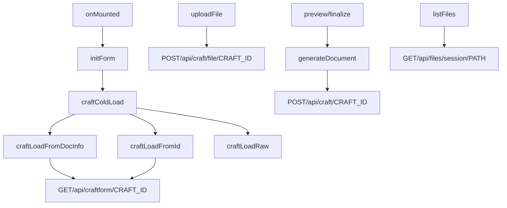

# ppw-wizard-craft

## GET /api/craft/{path}

On form init, or form reset, or to reload:

    gives
    - document path
    returns
    - schema
    - fields value
    - uploaded file list

## POST /api/craft/{path}

may be one or many of:

* on file upload, returns
    - upload status

* on field input, returns
    - upload status

* on preview/finalize, returns
    - generate status

## DELETE /api/craft/{path}